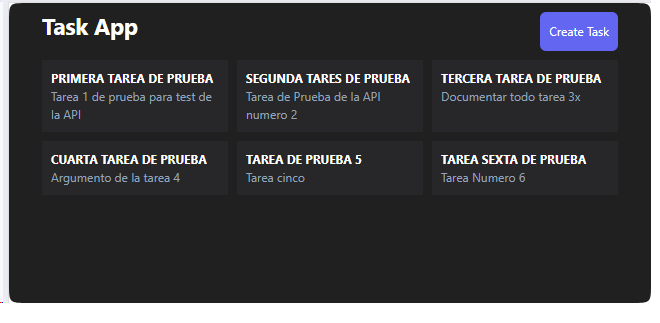

## Aplicación de control de Tareas

Aplicación para Administrar Actividades, versión mejoradas usando React y Django Rest Framework

| BackEnd | FrontEnd | Repositorio de Datos |
|-|-|-|
| APIs RestFramework Django   | React y Tailwinds | SQLite3 |

---

Paqueteria Utilizada en Django

| Paquete | Versión |
|-|-| 
| coreapi | 2.3.3 |
| coreschema | 0.0.4 |
| Django | 4.2.7 |
| django-cors-headers | 4.3.0 |
| djangorestframework | 3.14.0 |

Paqueteria Utilizada en React 

| Paquete | Versión |
|-|-| 
| axios | ^1.6.0 |
| react | ^18.2.0 |
| react-dom | ^18.2.0 |
| react-hook-form | ^7.47.0 |
| react-hot-toast | ^2.4.1 |
| react-router-dom | ^6.18.0 | 

---

---

|Raúl Ibáñez M.|
|-------------------------|   
